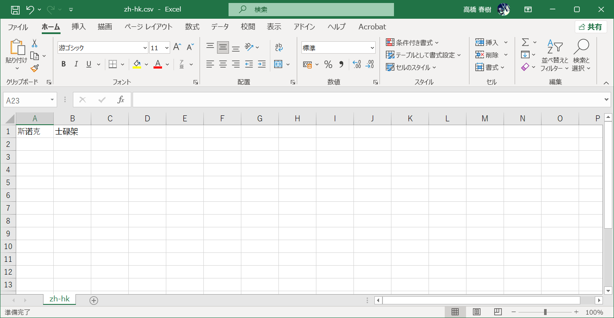

## 用前须知

**感谢使用Nya-WSL简繁转换工具！本工具基于[zhconv](https://github.com/gumblex/zhconv)进行简繁转换。[zhconv](https://github.com/gumblex/zhconv)词汇表来自[MediaWiki](https://www.mediawiki.org/)和[OpenCC](https://github.com/BYVoid/OpenCC/)**

**支持zh-cn/zh-tw/zh-hk/zh-sg/zh-hans/zh-hant之间相互转换。**

> 注意！
>   - 本工具仍在测试中。
>   - 代码授权协议采用 MIT 协议；zhconv中的转换表由于来自 MediaWiki，为 GPLv2+ 协议。

#### 使用方法

1. 运行文件夹内的"Chinese_Converter.exe"

2. 更新检测完成后，将文件拖入程序框中
3. 选择文件编码(测试功能存在较多bug，建议使用默认的UTF-8，留空按回车即可)
4. 选择目标语言的编号
5. 文件输出在导入文件的相同目录
6. 若使用自定义字典，请参照"[关于字典](#关于字典)"

#### 关于字典

[zhconv](https://github.com/gumblex/zhconv)支持使用自定义字典，自定义字典在dict目录下存在相对应的csv文件。如您需要自定义字典，可以直接编辑相对应的csv文件。csv文件内第一列为原语言，第二列为目标语言。
(例：如想定义zh-cn中"斯诺克"一词在转换成zh-hk时翻译为"士碌架"，则在zh-hk.csv内新增一行。写入行的第一列写入"斯诺克",写入行的第二行写入"士碌架"即可。见下图)

#### 关于简繁转换错误

本工具使用[zhconv](https://github.com/gumblex/zhconv)库进行简繁转换，但[zhconv](https://github.com/gumblex/zhconv)库在GitHub上更新时间为2021年10月31日，其中zhconv目录下的zhcdict.json作为其调用的字典，已有较长时间未更新。其中可能导致一些问题，如未按照习惯翻译(如"斯诺克"在部分繁体地区写作"司諾克"或"士碌架"，但因特殊词在2021年更新的zhcdict.json中并未给出，故会直接以单字的形式翻译为"斯諾克")，抑或是不存在字典内导致单字无法转换，遇到该情况可以手动编写zhcdict.json文件，或在dict目录下目标csv文件内新增。
后续可能会在正式版发布时推送新的zhcdict.json进行修复，如在使用上发现问题可以进行反馈。

#### 反馈方式：

- 邮箱：support@nya-wsl.com
- 提交issues

#### 附录

[MediaWiki源码包](https://www.mediawiki.org/wiki/Download)